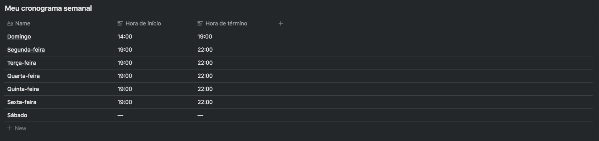
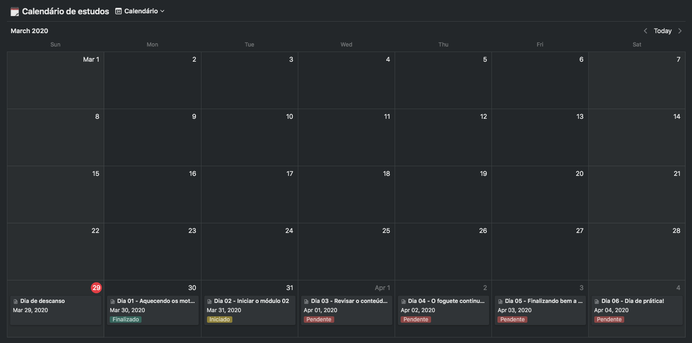

<h3 align="center">
  Challenge 01: Planning my studies
</h3>

<blockquote align="center">“Your only limitation is yourself”!</blockquote>

  

  

  

  

  <a href="#rocket-about-the-challenge">About the challenge</a>&nbsp;&nbsp;&nbsp;|&nbsp;&nbsp;&nbsp;
  <a href="#calendar-deliver">Deliver</a>&nbsp;&nbsp;&nbsp;|&nbsp;&nbsp;&nbsp;
  <a href="#memo-licence">Licence</a>

## :rocket: About the challenge

In this challenge, you must plan your studies.

For that, you must create a cronogram that will be adapted according to your time and rhythm.

Define what'll be your study schedule, creating tasks that will be attached to a calendar, to help you study and always be aligned with your goals!

### Cronogram template

To help you with that challenge, we created a template that you can duplicate through the Notion platform.
Notion works either on mobile or desktop platforms, and both can be downloaded in the [Oficial Page](https://www.notion.so/product).

To start using the template, you must access the link above and click in the button "Duplicate" which is in the menu at the top right of the screen.

📄 **[Link to the template](https://www.notion.so/Cronograma-de-estudos-e390bc8d2f5743668ec03348a3306070)**

### Defining a weekly schedule

  

In this section you must inform your schedule, the time you will dedicate for your journey as a developer, after all, the studies routine will be the first step in order to achieve your goals as quickly as possible!

### Defining a daily schedule

  

Here you must plan your daily tasks so you can be prepared to all the content that you'll consume during the week.

You can follow the available template above or create your own study schedule, so you can always be organized and focused on your goals.

We have already prepared everything that you can do in this first week of the bootcamp content, you just need to adapt it according to your routine.

Tip: Add extra content like readings and podcasts, remember to have short breaks to rest to assimulate the content studied. Also add time to create content, such as posts on a blog or linkedin.

## :calendar: Deliver

This challenge must be delivered

After completing the challenge, posting on Linkedin about it is a good way to demonstrate your efforts to evolve your career for future oportunities.

## :memo: Licence

This project is under license from MIT. See the archive [LICENSE](LICENSE) to more details.

---

Made with 💜 by Rocketseat :wave: [Be part of our community!](https://discordapp.com/invite/gCRAFhc)
