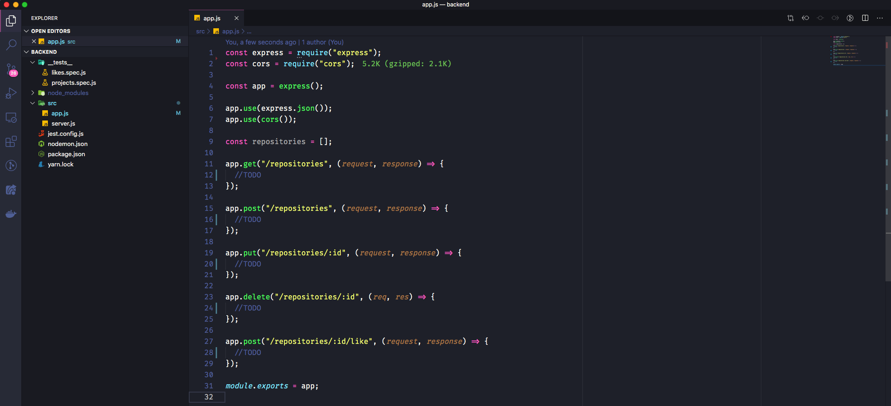

<h3 align="center">
  Challenge 02: Node.js Concepts
</h3>

<blockquote align="center">“Don't wait to plant, only have patience to harvest”!</blockquote>

  

  

  

  

  <a href="#rocket-about-the-challenge">About the challenge</a>&nbsp;&nbsp;&nbsp;|&nbsp;&nbsp;&nbsp;
  <a href="#calendar-deliver">Deliver</a>&nbsp;&nbsp;&nbsp;|&nbsp;&nbsp;&nbsp;
  <a href="#memo-licence">Licence</a>

## :rocket: About the challenge

In this challenge, you must create a application to practice what you have learned in Node.js!

Thils will be an application to storage repositories of your portfolio, that will allow you to list, update, and delete repositories, and besides that, the repositories can also receive likes.

### Application Template

We created a GitHub Template to help you with the challenge.

The template is available in the following URL: **[Access Template](https://github.com/Rocketseat/gostack-template-conceitos-nodejs)**

**Tip**: In case you don't know how to use Github repositories as templates, we have a guide in **[our FAQ](https://github.com/Rocketseat/bootcamp-gostack-desafios/tree/master/faq-desafios).**

Navigate to the created folder and open it in the Visual Studio Code, remember to execute the command `yarn` in your terminal in order to install all the dependencies, and you'll have something similar to that:

  

### Application Routes

Now that you already have the template cloned, and ready to continue, you must open the file app.js, and complete the places where there's no have code, with the code to achieve the goals of each route.

- **`POST /repositories`**: The route must receive `title`, `URL`, and `techs` inside of the request body. The URL must be the link to the Github of that repository. When registering a new project, it must be stored inside an object in the following format: `{id:" uuid ", title: 'Desafio Node.js', URL: 'http: //github.com / ...' , techs: ["Node.js", "..."], likes: 0} `; Make sure the ID is a UUID, and always start likes as 0.

- **`GET /repositories`**: The route that lists all repositories;

- **`PUT /repositories/:id`**: The route should only change the `title`, `URL` and `techs` of the repository that has the` id` equal to the `id` present in the route parameters;

- **`DELETE /repositories/:id`**: The route must delete a repository with the `id` present in the route parameters;

- **`POST /repositories/:id/like`**: The route must increase the number of likes from the specific repository chosen through the `id` param present in the route parameters, at each call of this route, the number of likes must be increased by 1;

**Tip**: In the code above, we used `POST` in a route, even though it changes the number of likes in the repository without creating anything directly.

If we semantically divide the responsibilities of our application into entities, the like would be an entity, and the repository would be another entity.

With that been said, we have different business rules for each entity, so, by calling the 'like' route and adding just one like, we can interpret that we are creating a new like, and not updating the likes.

So why not use `PUT` instead of `POST`? Precisely because we are "creating" A new like, and not updating the number of likes to any other value.

It may be difficult to see because it is just a number, but think that each like is saved in a table in the database with the user who added this like. Now it’s clearer that you’re creating a new like, right?

Good studies <3

### Tests Specification

In each test, you have a brief description of what your application must do in order for the test suits pass.

If you have questions about what the tests are, and how to interpret them, take a look at **[our FAQ](https://github.com/Rocketseat/bootcamp-gostack-desafios/tree/master/faq- challenges).**

For this challenge we have the following tests:

- **`should be able to create a new repository`**: In order for this test to pass, your application must allow a repository to be created, and return a JSON with the created project.

- **`should be able to list the repositories`**: In order for this test to pass, your application must return an array with all the repositories that have been created so far.

- **`should be able to update repository`**: In order for this test to pass, your application must allow only the `url`,` title` and `techs` fields to be changed.

- **`should not be able to update a repository that does not exist`**: In order for this test to pass, you must validate in your update route whether the repository id sent by the URL exists or not. If not, return an error with status `400`.

- **`should not be able to update repository likes manually`**: In order for this test to pass, you must not allow your update route to directly change the likes of that repository, maintaining the same number of likes that the repository already had before the update. That's because the only place that should update this information is the route responsible for increasing the number of likes.

- **`should be able to delete the repository`**: In order for this test to pass, you must allow your delete route to delete a project, and when deleted, it must return an empty response, with status `204`.

- **`should not be able to delete a repository that does not exist`**: In order for this test to pass, you must validate in your delete route whether the repository id sent by the URL exists or not. If not, return an error with status `400`.

- **`should be able to give a like to the repository`**: In order for this test to pass, your application must allow a repository with the given id to receive likes. The value of likes must be increased by 1 for each request, and as the result, return a JSON containing the repository with the number of likes updated.

- **`should not be able to like a repository that does not exist`**: In order for this test to pass, you must validate in your like route whether the repository id sent by the URL exists or not. If not, return an error with status `400`.

## :calendar: Deliver

This challenge must be delivered.

After completing the challenge, posting on Linkedin about it is a good way to demonstrate your efforts to evolve your career for future oportunities.

## :memo: Licence

This project is under license from MIT. See the archive [LICENSE](LICENSE) to more details.

---

Made with 💜 by Rocketseat :wave: [Join our community!](https://discordapp.com/invite/gCRAFhc)
