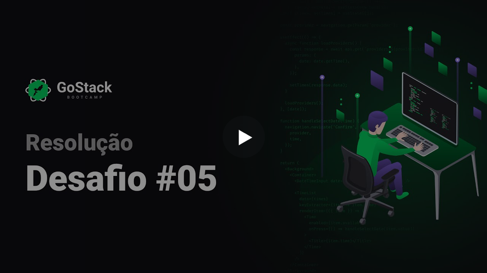

<h3 align="center">
  Desafio 05: Primeiro projeto Node.js
</h3>

<p align="center">“Para quem fica melhor a cada dia, ficar pronto é utopia”!</blockquote>

<p align="center">
  

  <a href="https://rocketseat.com.br">
    
  </a>

  

  <a href="https://github.com/Rocketseat/bootcamp-gostack-desafios/stargazers">
    
  </a>
</p>

<p align="center">
  <a href="#rocket-sobre-o-desafio">Sobre o desafio</a>&nbsp;&nbsp;&nbsp;|&nbsp;&nbsp;&nbsp;
  <a href="#calendar-entrega">Entrega</a>&nbsp;&nbsp;&nbsp;|&nbsp;&nbsp;&nbsp;
  <a href="#memo-licença">Licença</a>
</p>

## :rocket: Sobre o desafio

Nesse desafio, você deve criar uma aplicação para continuar treinando o que você aprendeu até agora no Node.js junto ao TypeScript, utilizando o conceito de models, repositories e services!

Essa será uma aplicação para que deve armazenar transações financeiras de entrada e saída, que deve permitir o cadastro e a listagem dessas transações.

### Template da aplicação

Para te ajudar nesse desafio, criamos para você um modelo que você deve utilizar como um template do Github.

O template está disponível na seguinte url: **[Acessar Template](https://github.com/Rocketseat/gostack-template-fundamentos-node)**

**Dica**: Caso não saiba utilizar repositórios do Github como template, temos um guia em **[nosso FAQ](https://github.com/Rocketseat/bootcamp-gostack-desafios/tree/master/faq-desafios).**

Agora navegue até a pasta criada e abra no Visual Studio Code, lembre-se de executar o comando `yarn` no seu terminal para instalar todas as dependências.

### Rotas da aplicação

Agora que você já está com o template clonado, e pronto para continuar, você deve verificar os arquivos da pasta `src` e completar onde não possui código com o código para atingir os objetivos de cada rota.

- **`POST /transactions`**: A rota deve receber `title`, `value` e `type` dentro do corpo da requisição, sendo `type` o tipo da transação, que deve ser `income` para entradas (depósitos) e `outcome` para saidas (retiradas). Ao cadastrar uma nova transação, ela deve ser armazenada dentro de um objeto com o formato como o seguinte:

```json
{
  "id": "uuid",
  "title": "Salário",
  "value": 3000,
  "type": "income"
}
```

- **`GET /transactions`**: Essa rota deve retornar uma listagem com todas as transações que você cadastrou até agora, junto com o valor de soma de entradas, retiradas e total de crédito. Essa rota deve retornar um objeto com o formato a seguir:

```json
{
  "transactions": [
    {
      "id": "uuid",
      "title": "Salário",
      "value": 4000,
      "type": "income"
    },
    {
      "id": "uuid",
      "title": "Freela",
      "value": 2000,
      "type": "income"
    },
    {
      "id": "uuid",
      "title": "Pagamento da fatura",
      "value": 4000,
      "type": "outcome"
    },
    {
      "id": "uuid",
      "title": "Cadeira Gamer",
      "value": 1200,
      "type": "outcome"
    }
  ],
  "balance": {
    "income": 6000,
    "outcome": 5200,
    "total": 800
  }
}
```

**Dica**: Dentro de balance, o income é a soma de todos os valores das transações com `type` income. O outcome é a soma de todos os valores das transações com `type` outcome, e o total é o valor de `income - outcome`.

**Dica 2**: Para fazer a soma dos valores, você pode usar a função [reduce](https://developer.mozilla.org/pt-BR/docs/Web/JavaScript/Reference/Global_Objects/Array/reduce) para agrupar as transações pela propriedade `type`, assim você irá conseguir somar todos os valores com facilidade e obter o retorno do `balance`.

### Específicação dos testes

Em cada teste, tem uma breve descrição no que sua aplicação deve cumprir para que o teste passe.

Caso você tenha dúvidas quanto ao que são os testes, e como interpretá-los, dé uma olhada em **[nosso FAQ](https://github.com/Rocketseat/bootcamp-gostack-desafios/tree/master/faq-desafios).**

Para esse desafio temos os seguintes testes:

- **`should be able to create a new transaction`**: Para que esse teste passe, sua aplicação deve permitir que uma transação seja criada, e retorne um json com a transação criado.

- **`should be able to list the transactions`**: Para que esse teste passe, sua aplicação deve permitir que seja retornado um objeto contendo todas as transações junto ao balanço de income, outcome e total das transações que foram criadas até o momento.

- **`should not be able to create outcome transaction without a valid balance`**: Para que esse teste passe, sua aplicação não deve permitir que uma transação do tipo `outcome` extrapole o valor total que o usuário tem em caixa, retornando uma resposta com código HTTP 400 e uma mensagem de erro no seguinte formato: `{ error: string }`

## :calendar: Entrega

Esse desafio deve ser entregue a partir da plataforma Skylab, envie o link do repositório que você fez suas alterações. Após concluir o desafio, fazer um post no Linkedin e postar o código no Github é uma boa forma de demonstrar seus conhecimentos e esforços para evoluir na sua carreira para oportunidades futuras.

## Solução do desafio

Caso você queira ver como resolver o desafio, fizemos um video explicando o passo a passo para cumprir com todos os requisitos da aplicação:

<a href="https://youtu.be/FYsFvjM6AJM" target="_blank" align="center">
  
</a>

## :memo: Licença

Esse projeto está sob a licença MIT. Veja o arquivo [LICENSE](LICENSE) para mais detalhes.

---

Feito com 💜 by Rocketseat :wave: [Entre na nossa comunidade!](https://discordapp.com/invite/gCRAFhc)
