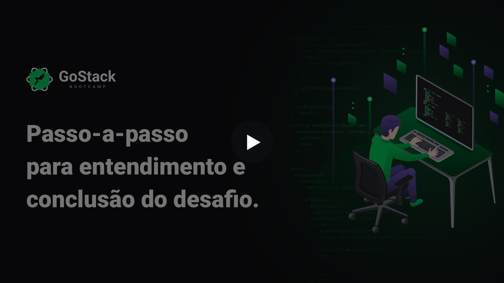
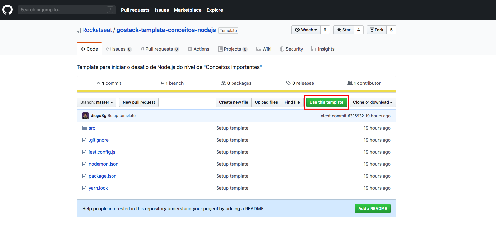
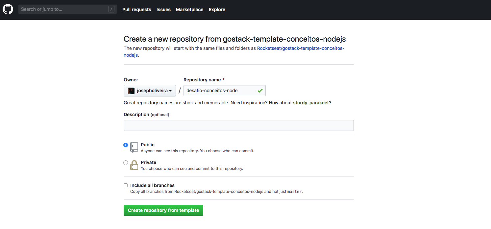
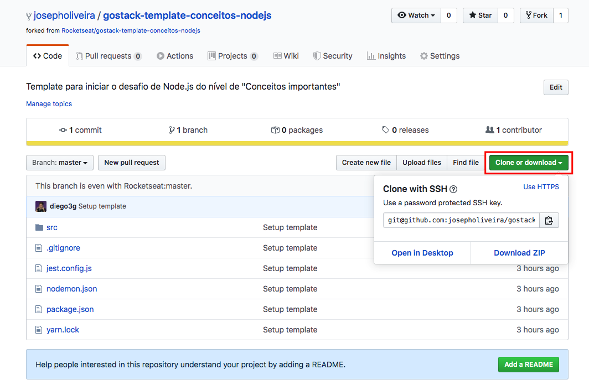
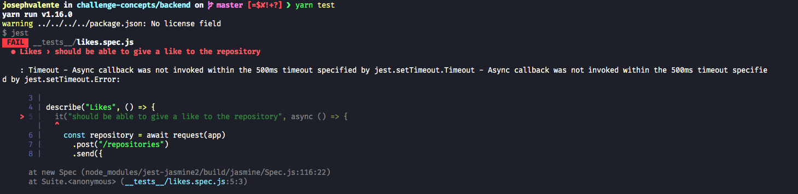
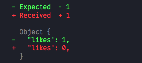

<h2 align="center">
  FAQ referente aos desafios
</h2>

## Dúvidas

- [Como utilizar um repositório do github como template?](#como-utilizar-um-repositório-do-github-como-template)
- [O que são os testes automatizados?](#o-que-são-os-testes-automatizados)
- [Como interpretar os erros nos testes?](#como-interpretar-os-erros-nos-testes)

### Introdução

Para facilitar o entendimento das principais dúvidas dos alunos, adicionamos um vídeo mostrando tudo que você precisa saber para conseguir entregar os desafios:

### Como utilizar um repositório do github como template?

Em alguns desafios, você precisará fazer o download de um template que disponibilizamos para ter consigo uma estrutura inicial e os testes que disponibilizamos que serão utilizados na correção desses desafios.

Para isso, você vai precisar criar um novo repositório a partir do template do repositório relacionado ao desafio que você deseja.

Para utilizar esse template, você precisa seguir os seguintes passos:

- **1º passo**: Acesse a página do github do desafio de interesse.
- **2º passo**: Dentro da página do github, clique no botão "Use this template" na tela do repositório.

  

- **3º passo**: Após clicar no botão, você será redirecionado para uma nova página que você deve escolher o nome do repositório que você irá criar a partir do template. Dê um nome ao repositório e clique em "Create repository from template".

  

- **4º passo**: Você será redirecionado para a página do seu usuário com o projeto que foi duplicado a partir do template.

- **5º passo**: Para clonar o repositório, clique no botão "Clone or download" e irá aparecer um menu. Copie a URL que aparece logo abaixo do botão.

  

- **6º passo**: No seu terminal, navegue até a sua pasta de preferência e rode o comando `git clone {URL_DO_REPOSITORIO}`, isso irá baixar todos os arquivos para a sua máquina. (Lembre-se que você precisa do Git instalado em sua máquina, caso ainda não tenha: https://git-scm.com/)

- **7º passo**: Com seu repositório baixado na sua máquina, execute o comando `yarn` na pasta do projeto clonado para instalar todas as dependências.

- **8º passo**: Agora é só você fazer todas as alterações que você desejar, e envia-las para o github para o repositório que você acabou de criar utilizando o template.

**Dica**: Caso você não tenha conhecimento sobre Git & Github, temos bonus exclusivos para nossos alunos do Bootcamp GoStack ensinando tudo sobre a ferramenta. Além de um [vídeo no youtube](https://www.youtube.com/watch?v=2alg7MQ6_sI) sobre o assunto.

### O que são os testes automatizados?

Para te ajudar a saber se você está no caminho certo, no projeto que você já clonou deixamos alguns testes automatizados.

Os testes sempre vão ficar dentro de uma pasta chamada `__tests__` dentro da pasta `src`.

Dentro da pasta de testes, para cada arquivo testado na sua aplicação, existe um arquivo com o mesmo nome, com a extensão `.spec.js`.

Para começar a utilizar os testes, execute o comando `yarn test` no seu terminal, e ele irá te retornar o resultado dos testes das rotas.

Isso deve te retornar vários erros logo após clonar o projeto, como esse:

  

Esse erro significa que a princípio o teste não recebeu nenhum retorno das rotas, então é agora que é a hora de codar, experimente ir adicionando seus códigos para cumprir os requisitos do desafio. :rocket:

**Dica 1**: Nem sempre você precisa usar apenas os testes para saber se tudo está funcionando, você pode sempre executar o `yarn dev` e testar sua aplicação utilizando o insomnia caso prefira.

**Dica 2**: Esses testes serão os mesmos testes que e irão corrigir seu desafio e darão sua nota, então recomendamos que os siga a risca e tenha certeza que todos passem para receber nota máxima!

### Como interpretar os erros nos testes?

Agora que você já sabe como rodar os testes, você também deve entender a interpretá-los. Vamos começar analisando a seguinte imagem:

  

Logo acima da imagem, temos em vermelho um título que específica qual teste deu errado. Nesse caso o teste que falhou é o teste **`should be able to give a like to the repository`**, do módulo de **Likes**.

Para entender o que deu de errado, posso olhar exatamente esse trecho:

  

Disso podemos entender que o teste esperava receber o valor `likes: 1`, mas recebeu `likes: 0`.

Sabendo disso, nesse exemplo, se formos até o código, vamos ver que de fato a função de aumentar o número de likes nunca incrementou esse valor, então os likes do repositório encontrado sempre serão retornados como 0.

  

## :memo: Licença

Esse projeto está sob a licença MIT. Veja o arquivo [LICENSE](LICENSE.md) para mais detalhes.

---

Feito com 💜 by Rocketseat :wave: [Entre na nossa comunidade!](https://discordapp.com/invite/gCRAFhc)
